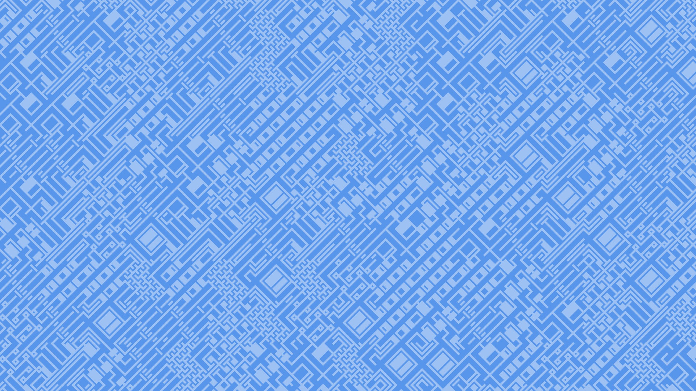

<p align="center">

</p>

# Amaze

Maze pattern generator.

## Boxwood


<br />

## Labyrinth


<br />

## Metropolis



<br />

## Palazzo


<br />

## Path


<br />

## Sandcastle


<br />

## Underworld


<br />

## Utopia


<br />

## Ziggurat

<br />


# Usage

```
go run amaze.go [optional args] filename

  -a    Create one frame per character in character set.
  -bg string
        Background color in format 'R,G,B' or in hex format. (default "255,255,255")
  -chars string
        Character set to use for patterns. (default "0123456789abcdefghijklmnopqrstuvwxyzABCDEFGHIJKLMNOPQRSTUVWXYZ!\"#$%&'()*+,-./:;<=>?@[\\]^_`{|}~")
  -fg string
        Foreground color in format 'R,G,B' or in hex format. (default "0,0,0")
  -font string
        Font to write letters in. One of: boxwood, labyrinth, metropolis, palazzo, path, sandcastle, underworld, utopia, ziggurat. (default "metropolis")
  -h int
        Image height. (default 1080)
  -l int
        Limit the number of animation frames created. (default 94)
  -r    Generate Random Patterns.
  -size int
        Font Size. (default 100)
  -w int
        Image width. (default 1920)
```

# Dependencies

This script depends on the [Go Graphics (gg)](https://github.com/fogleman/gg) library by [Michael Fogleman](https://github.com/fogleman).

```
go get -u github.com/fogleman/gg
```

# Acknowledgements

* These maze patterns were made possible by the fonts available at [mazeletter.xyz](http://mazeletter.xyz/). Credit goes to [Paul Cronan](https://medium.com/fathominfo/building-a-maze-typeface-a6a2afa5ab73) and team for these incredible fonts.